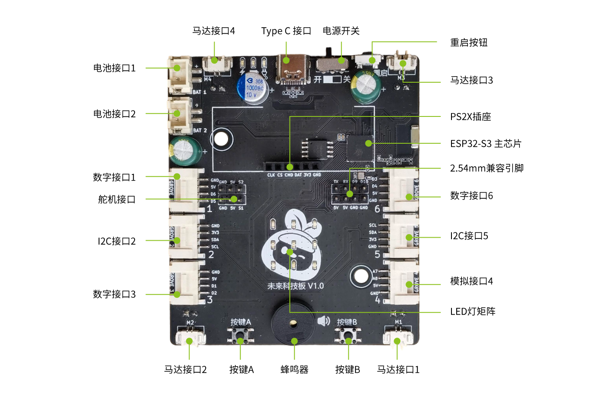

# 🤖 未来科技盒 2.0 自动编程烧录 Skill

<p align="center">
  
</p>

<p align="center">
  <b>让 AI 帮你写硬件代码，自然语言 → 编译 → 烧录，一气呵成！</b>
</p>

<p align="center">
  <a href="#功能特性">功能特性</a> •
  <a href="#快速开始">快速开始</a> •
  <a href="#使用示例">使用示例</a> •
  <a href="#开发状态">开发状态</a> •
  <a href="#更新计划">更新计划</a>
</p>

---

## ⚠️ 重要声明

> **当前版本：v0.2.0-beta（小车形态支持）**
>
> 🎯 **仅支持「未来科技盒 2.0」主板**（基于 Seeed XIAO ESP32S3）
>
> ❌ 暂不支持其他版本的未来科技盒（1.0、3.0 等）
>
> ✅ **新增小车形态完整支持！**

---

## ✨ 功能特性

### 🗣️ 自然语言编程
用中文描述你想要的功能，AI 自动生成代码：

```
"让 LED 灯从 1 号到 9 号依次点亮"
"按下按键 A 蜂鸣器响一声，点亮所有灯"
"让小车前进 3 秒后停止"
"实现循迹小车功能"
"用 PS2 手柄遥控小车"
"读取当前温度和湿度"
```

### 🔄 一键烧录
代码生成后自动编译、烧录到主板，无需手动操作。

### 🖥️ 跨平台支持
- ✅ Windows
- ✅ macOS
- ✅ Linux

---

## 📁 项目结构

```
.
├── .codebuddy/
│   └── skills/
│       └── future-tech-box-programmer/   # 🎯 Skill 核心文件
│           ├── SKILL.md                  # Skill 主配置
│           ├── README.md                 # Skill 说明
│           ├── references/               # 硬件参考文档
│           │   ├── future_tech_box_v2_hardware.md
│           │   ├── pinout_mapping.csv
│           │   └── libraries/            # 库文件（PS2X_lib 等）
│           └── scripts/                  # 辅助脚本
│               ├── check_environment.py
│               ├── detect_port_*.py
│               └── upload_with_retry.py
│
├── buzzer_led_test/                      # 📦 示例项目：蜂鸣器+LED
├── led_key_test/                         # 📦 示例项目：按键+LED
├── led_sequence_test/                    # 📦 示例项目：LED 序列
├── motor_test/                           # 📦 示例项目：电机测试
├── line_follower/                        # 📦 示例项目：循迹小车
├── i2c_sensor_test/                      # 📦 示例项目：I2C 传感器
├── ultrasonic_test/                      # 📦 示例项目：超声波测距
├── ultrasonic_led_map/                   # 📦 示例项目：超声波+LED联动
├── random_melody/                        # 📦 示例项目：随机旋律
│
├── 补充2.0/                              # 📚 额外资料和库文件
├── 未来科技盒2.0主板.png                  # 主板图片
├── 超声波传感器.png                       # 超声波传感器图片
├── 未来科技盒2.0引脚设置-工作表1.csv      # 引脚映射表（原始）
└── README.md                             # 本文件
```

---

## 🚀 快速开始

### 1️⃣ 环境要求

| 依赖 | 版本要求 | 说明 |
|------|---------|------|
| CodeBuddy IDE | 最新版 | 支持 Skill 功能 |
| Python | ≥ 3.8 | 运行辅助脚本 |
| PlatformIO CLI | ≥ 6.0 | 编译和烧录 |

### 2️⃣ 安装 Skill

将 `.codebuddy/skills/future-tech-box-programmer/` 文件夹复制到：

**方式 A：项目级（仅当前项目可用）**
```
your-project/.codebuddy/skills/future-tech-box-programmer/
```

**方式 B：用户级（全局可用）**
```
# Windows
%USERPROFILE%\.codebuddy\skills\future-tech-box-programmer\

# macOS / Linux
~/.codebuddy/skills/future-tech-box-programmer/
```

### 3️⃣ 连接主板

1. 使用 **数据线**（非充电线）连接未来科技盒 2.0
2. 确认设备管理器/串口列表中出现 COM 端口

### 4️⃣ 开始使用

在 CodeBuddy 中输入类似指令：

```
编程未来科技盒：让 LED 呼吸灯效果
```

---

## 💡 使用示例

### LED 矩阵控制

```
"点亮 5 号 LED（正中间那个）"
"让所有 LED 闪烁 3 次"
"LED 从左上角到右下角依次亮起"
"做一个爱心图案"
```

### 按键控制

```
"按下按键 A 点亮所有灯，按下按键 B 熄灭"
"按一下按键切换 LED 开关状态"
```

### 蜂鸣器

```
"蜂鸣器响一声"
"播放一段简单的音乐"
"按键时发出提示音"
```

### 超声波传感器

```
"显示超声波测量的距离"
"距离小于 20cm 时蜂鸣器报警"
"根据距离点亮不同数量的 LED"
```

### 🚗 小车控制（v0.2.0 新增）

```
"让小车前进 3 秒后停止"
"让小车以 70% 速度前进"
"让小车左转 90 度"
"实现循迹小车功能"
"做一个避障小车"
```

### 🎮 PS2 手柄控制（v0.2.0 新增）

```
"用 PS2 手柄遥控小车"
"左摇杆控制前进后退，右摇杆控制转向"
"按 X 键蜂鸣器响一声"
```

### 📡 I²C 传感器（v0.2.0 新增）

```
"读取当前温度和湿度"
"检测物体颜色"
"读取加速度计数据判断倾斜方向"
```

### 🦾 舵机/机械臂（v0.2.0 新增）

```
"让舵机转到 90 度"
"控制机械臂抓取物体"
"做一个挥手动作"
```

### 组合功能

```
"按下按键 A 蜂鸣器响一声同时点亮所有 LED"
"做一个简单的游戏：按键控制 LED 移动"
"用 PS2 手柄遥控机械臂小车"
```

---

## 📊 开发状态

### ✅ 已完成

| 模块 | 功能 | 状态 |
|------|------|------|
| **LED 矩阵** | 行列扫描显示 | ✅ |
| | 单灯/全部控制 | ✅ |
| | 编号-索引映射 | ✅ |
| **按键** | 边沿检测 | ✅ |
| | 非阻塞消抖 | ✅ |
| **蜂鸣器** | tone() 播放 | ✅ |
| | 非阻塞控制 | ✅ |
| **超声波** | HC-SR04 测距 | ✅ |
| | LED 联动显示 | ✅ |
| **电机** | 4电机 PWM 调速 | ✅ |
| | 前进/后退/转弯/横移 | ✅ |
| **循迹** | 双路循迹传感器 | ✅ |
| | 循迹小车 | ✅ |
| **舵机** | 双舵机角度控制 | ✅ |
| | 机械臂抓取 | ✅ |
| **PS2 手柄** | 双摇杆控制 | ✅ |
| | 按键检测 | ✅ |
| **I²C 传感器** | LIS3DHTR 加速度计 | ✅ |
| | VEML6040 颜色传感器 | ✅ |
| | DHT20 温湿度传感器 | ✅ |
| **环境检测** | 跨平台支持 | ✅ |
| **串口检测** | Windows/macOS/Linux | ✅ |

### 📋 计划中

- [ ] Grove 传感器扩展支持
- [ ] 更多动画效果模板
- [ ] 音乐播放器功能
- [ ] 语音识别模块
- [ ] 未来科技盒 3.0 支持（待硬件发布）

---

## 🔧 更新计划

### v0.3.0（计划中）
- [ ] Grove 传感器集成
- [ ] 蓝牙通信支持
- [ ] WiFi 控制功能

### v1.0.0（远期目标）
- [ ] 所有硬件功能完整支持
- [ ] 多版本主板兼容
- [ ] 完整的教程文档

---

## 🐛 已知问题

1. **首次编译耗时长**
   - 原因：需要下载 ESP32 工具链（约 300-500MB）
   - 解决：首次编译请耐心等待 5-20 分钟

2. **Linux 串口权限**
   - 解决：`sudo usermod -a -G dialout $USER` 后重新登录

3. **烧录偶尔失败**
   - 解决：按一下主板 RST 按钮后重试

4. **命令超时**
   - 原因：长时间编译可能触发 IDE 超时
   - 解决：可在终端手动执行 `pio run -t upload`

---

## 📝 更新日志

### v0.2.0-beta (2026-04-06)

**🚗 小车形态完整支持：**
- ✅ 新增 4 电机 PWM 控制（M1-M4）
- ✅ 支持前进/后退/左转/右转/原地转/横移
- ✅ 新增循迹传感器支持（双路循迹）
- ✅ 新增循迹小车示例

**📡 I²C 传感器支持：**
- ✅ LIS3DHTR 三轴加速度计（±2g~±16g）
- ✅ VEML6040 RGBW 颜色传感器
- ✅ DHT20 温湿度传感器

**🎮 外设支持：**
- ✅ PS2 手柄遥控（双摇杆、按键检测）
- ✅ 双舵机/机械臂控制

**📚 文档和示例：**
- ✅ 大幅更新硬件文档（800+ 行）
- ✅ 新增 motor_test、line_follower、i2c_sensor_test 示例
- ✅ 添加 PS2X_lib 库到 references

### v0.1.1-beta (2026-03-16)

**新增功能：**
- ✅ 超声波传感器支持（HC-SR04，测距 3-350cm）
- ✅ 超声波 + LED 矩阵联动示例
- ✅ 随机旋律功能

### v0.1.0-beta (2025-03-16)

**新增功能：**
- ✅ LED 矩阵完整支持（行列扫描）
- ✅ 按键边沿检测 + 非阻塞消抖
- ✅ 蜂鸣器非阻塞控制
- ✅ 跨平台环境检测脚本
- ✅ 带重试的烧录脚本

**Bug 修复：**
- 🐛 修复按键消抖逻辑 BUG（共享 lastDebounceTime 导致无响应）
- 🐛 修复蜂鸣器 API 问题（ledcSetup 旧 API 兼容性）
- 🐛 修复 LED 扫描卡顿问题（delay 阻塞）

---

## 🤝 贡献

欢迎提交 Issue 和 Pull Request！

**特别欢迎：**
- 🐛 Bug 报告
- 💡 功能建议
- 📖 文档改进
- 🔧 代码优化

---

## 📄 License

MIT License

---

<p align="center">
  Made with ❤️ for Future Tech Box
</p>
